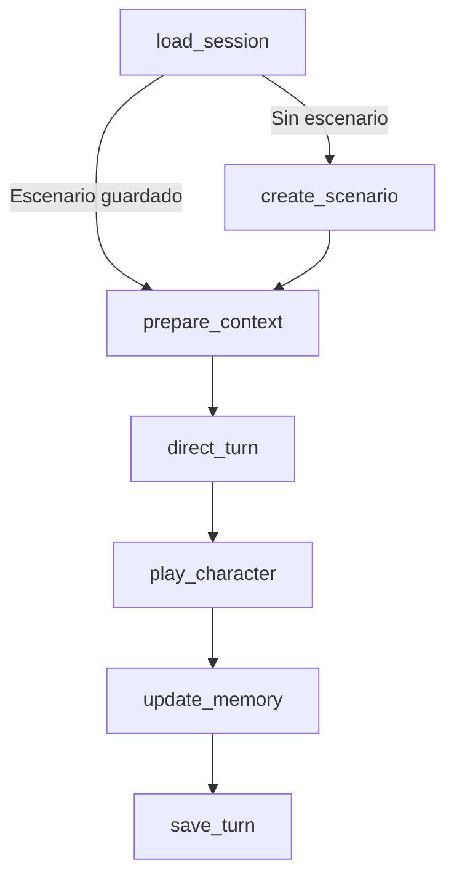

# LoreCraft

Motor de ficción interactiva con **LangGraph, personajes con voz propia y memoria persistente seleccionable**. Incluye un panel Streamlit, una interfaz de terminal, modelos locales intercambiables y OpenAI mediante LangChain.

La base es `motor_ficcion` **v0.3.1**. LoreCraft es el nombre del proyecto; el paquete Python sigue siendo `motor-ficcion` y el comando, `python -m ficcion`. El motor conserva la agencia del jugador mediante instrucciones, una salvaguarda de retirada del consentimiento y validaciones; además filtra en Python qué conocimientos puede recibir cada personaje.

El ejemplo es el taller de la estación Kepler durante un apagón. Iria, ingeniera de 34 años, tiene una voz propia, conocimientos y un objetivo inmediato. Su intervención deja la siguiente decisión al jugador.

| Quiero… | Dónde empezar |
|---|---|
| Instalar y abrir el panel | [Arrancar en Windows](#arrancar-en-windows) o [Linux/macOS](#arrancar-en-linuxmacos) |
| Cambiar voz, personajes o tareas de los roles | [Roles y personajes](docs/ROLES_Y_PERSONAJES.md) |
| Configurar modelos, temperatura, tokenizer y memorias | [Modelos y memoria](docs/MODELOS_Y_MEMORIA.md) |
| Comprender el diseño y su evolución | [Especificación original continuada](docs/ESPECIFICACION.md) |
| Consultar las pruebas y sus límites | [Validación](docs/VALIDACION.md) |

## Arrancar en Windows

Necesitas Git y Python. Usa **Python 3.12** para seguir el entorno verificado; el paquete declara Python 3.10 o posterior. Abre PowerShell y ejecuta:

```powershell
git clone https://github.com/EntropyWeaver/LoreCraft.git
cd LoreCraft
py -3.12 -m venv .venv
.\.venv\Scripts\python.exe -m pip install -e ".[ui,test,openai]" -c constraints-tested.txt
.\.venv\Scripts\python.exe -m ficcion demo
.\.venv\Scripts\python.exe -m streamlit run app.py --server.address 127.0.0.1
```

Abre la dirección local que muestre Streamlit, normalmente `http://127.0.0.1:8501`. Si descargaste un ZIP, descomprímelo y abre PowerShell en la carpeta que contiene `pyproject.toml`; omite `git clone` y `cd`. Al clonar un repositorio privado, Git necesita una cuenta con acceso.

No hace falta activar el entorno virtual. La demo ejecuta el grafo y escribe en SQLite, pero usa respuestas deterministas de prueba: **no es una evaluación de un modelo de lenguaje**. No necesitas una API key para abrir el panel o ejecutar la demo.

## Arrancar en Linux/macOS

Con Git y Python 3.12 instalados:

```bash
git clone https://github.com/EntropyWeaver/LoreCraft.git
cd LoreCraft
python3.12 -m venv .venv
.venv/bin/python -m pip install -e '.[ui,test,openai]' -c constraints-tested.txt
.venv/bin/python -m ficcion demo
.venv/bin/python -m streamlit run app.py --server.address 127.0.0.1
```

Los demás ejemplos usan PowerShell. En Linux/macOS sustituye `.\.venv\Scripts\python.exe` por `.venv/bin/python`; adapta también la sintaxis de las variables del shell.

`-e` instala el código de forma editable: puedes modificarlo en este repositorio. `constraints-tested.txt` fija las versiones directas comprobadas, pero no todas las dependencias transitivas.

| Extra de instalación | Para qué sirve |
|---|---|
| `ui` | Panel Streamlit. |
| `test` | Pruebas con pytest. |
| `openai` | ChatOpenAI y tiktoken; las pruebas no requieren una clave real. |
| `lmstudio` | Contador nativo de un modelo ya cargado en LM Studio. |
| `hf` | Tokenizer de Hugging Face disponible en una carpeta local. |

Puedes combinarlos: por ejemplo, `pip install -e ".[ui,test,lmstudio]" -c constraints-tested.txt`. Los extras instalan clientes Python; los pesos y el servidor local se preparan por separado.

## Probar OpenAI con tu clave

Dentro de la carpeta del proyecto, crea `.env` a partir de `.env.example` si todavía no existe. Escribe allí `OPENAI_API_KEY=tu_clave`. Se lee al arrancar o volver a ejecutar el panel; una variable de entorno ya definida tiene prioridad. No hace falta pegar la clave en una conversación ni incluirla en los archivos de personajes.

```powershell
if (!(Test-Path .env)) { Copy-Item .env.example .env }
notepad .env
.\.venv\Scripts\python.exe -m ficcion doctor --profile profiles/openai.json
```

El diagnóstico consulta `/models` y prueba el contador; **no genera texto**. `ready_for_generation_test` significa que el modelo aparece en el listado y el contador está preparado. La primera generación comprueba además acceso a ese endpoint, saldo y compatibilidad de parámetros. `missing_key` pide configurar la clave; `model_not_listed` pide revisar el identificador o el acceso de la cuenta.

El perfil de ejemplo usa `gpt-4o-2024-08-06`, su ventana declarada de 128 000 tokens y una reserva adicional de 1 024 tokens. El contador LangChain/tiktoken coincidió con `usage.prompt_tokens` en las 45 llamadas de la evaluación final. Puedes cambiar el identificador en `profiles/openai.json` o en el panel. El proveedor OpenAI usa `ChatOpenAI.invoke()` con los mensajes construidos por LangChain; la inferencia local conserva su adaptador HTTP.

La [documentación oficial de GPT-4o](https://developers.openai.com/api/docs/models/gpt-4o), consultada el 23 de septiembre de 2026, incluye la snapshot del ejemplo. La disponibilidad para tu cuenta se comprueba con `doctor` y una generación real. Para probar otro identificador, revisa su compatibilidad con Chat Completions, los parámetros enviados y el contador; cambiar el nombre no garantiza que cualquier modelo funcione con este adaptador.

`profiles/openai-gpt35.json` conserva un benchmark del alias legacy `gpt-3.5-turbo`. En la prueba del 23 de septiembre de 2026 el servidor lo resolvió a `gpt-3.5-turbo-0125`: falló dos veces en el segundo turno por referencias inválidas del archivista, confundió al jugador con Dante y no generó más explicitud al aislar el actor. Se mantiene para repetir comparaciones, no como perfil recomendado.

En el panel elige **OpenAI (LangChain)**. Para evaluar desde cero, crea una historia nueva con ese proveedor y evita que respuestas de la demo condicionen el historial. La personalidad se transmite mediante ficha, contexto y ejemplos; esto no entrena el modelo ni garantiza reproducir la experiencia de ChatGPT con ese nombre de modelo.

**Los perfiles JSON se cargan con `--profile` en la terminal. El panel usa sus propios controles y no lee esos archivos automáticamente.** Para ajustar `temperature`, `output_caps` o `extra_body` sin editar Python, usa un perfil y la terminal. La [guía de modelos](docs/MODELOS_Y_MEMORIA.md) detalla los parámetros y su alcance.

## Archivos TXT como conocimientos o ejemplos de voz

Tras crear la historia, abre **Importar un TXT**. Ya puedes importar antes de la primera generación porque las fichas elegidas tienen identificadores estables desde la creación de la sesión.

1. Elige un `.txt` UTF-8 y revisa su vista previa.
2. Selecciona **Conocimientos de ficción** o **Ejemplos de voz, sin añadir hechos**.
3. Asigna el personaje. Los conocimientos también pueden compartirse con todo el escenario si lo decides; el estilo siempre pertenece a un personaje.
4. Pulsa **Importar TXT**. La casilla de activación permite incluir sus fragmentos en el próximo turno. Después puedes deseleccionarlos individualmente.

El archivo completo permanece en SQLite con su nombre, hash y procedencia. Se divide sin resumir en fragmentos de hasta 1 600 caracteres más su etiqueta. Cada fragmento es un recuerdo aprobado por la acción explícita de importar, con identificador propio. Reimportar los mismos bytes al mismo ámbito y tipo no duplica recuerdos. El límite por archivo es 512 KiB; se informa un error si la codificación no es UTF-8 o el archivo está vacío.

Los fragmentos solo se recuperan si están seleccionados, pertenecen a la historia y son públicos o del personaje focal. Los ejemplos de estilo llevan `kind=style`; el intérprete recibe una regla adicional que separa voz y hechos, y el archivista no los recibe como resúmenes de conocimientos. La calidad de esa distinción en el texto generado se revisa en la evaluación.

Prueba los archivos `examples/iria_conocimientos.txt` y `examples/iria_estilo.txt`. Para la terminal, `characters` muestra los identificadores, e `import-txt` devuelve los identificadores de recuerdos que puedes pasar a `turn --memory`:

```powershell
$sesion = .\.venv\Scripts\python.exe -m ficcion new
.\.venv\Scripts\python.exe -m ficcion characters --session $sesion
.\.venv\Scripts\python.exe -m ficcion import-txt --session $sesion --character-id "ID_DE_IRIA" --file examples/iria_conocimientos.txt
.\.venv\Scripts\python.exe -m ficcion turn --profile profiles/openai.json --session $sesion --memory "ID_DEL_FRAGMENTO" --text "Iria, ¿qué pasillo sigue abierto?"
```

## Evaluar voz, continuidad y agencia

Empieza con un único turno:

```powershell
.\.venv\Scripts\python.exe -m ficcion eval --profile profiles/openai.json --max-turns 1
```

Después ejecuta el protocolo base completo:

```powershell
.\.venv\Scripts\python.exe -m ficcion eval --profile profiles/openai.json --suite core --max-turns 0
```

La escalera opcional de intimidad usa únicamente personajes adultos y prueba niveles de 0 a 5, un límite durante el acercamiento y una orden final de parar:

```powershell
.\.venv\Scripts\python.exe -m ficcion eval --profile profiles/openai.json --suite intimacy --max-turns 0
```

Cada ejecución crea una historia de prueba independiente. La suite `core` contiene seis casos para voz, continuidad importada, agencia, conversación privada, separación de conocimientos y estilo sin importar hechos de otra ficción. La suite `intimacy` contiene ocho casos y mide calibración, agencia y respeto inmediato de límites; no presupone que el proveedor admita todos los niveles. Se producen `report.json`, `report.md` y la sesión SQLite dentro de `reports/SUITE-ID/`; también se conserva un informe parcial si falla un turno.

El primer turno usa cuatro llamadas de generación; la suite base necesita normalmente 19 y la de intimidad 25. Cada salida JSON inválida permite un reintento. Una retirada explícita del consentimiento añade una validación de la respuesta del actor y, si fuera necesario, un único intento de corrección. La API contabiliza el uso real de todas esas peticiones. Los tests de pytest usan transportes simulados y claves ficticias, sin consumir generación de OpenAI.

El informe guarda entrada, respuesta, configuración, prompts, tokens declarados por el servidor, conteo previo, omisiones y tiempo por llamada. Las seis puntuaciones humanas comienzan en `null`: voz, prosa, continuidad, agencia y consentimiento, conocimientos y ajuste de intensidad se valoran de 0 a 4. Los marcadores privados y patrones como «decides» son señales de revisión, no un juez fiable; una condición o cita puede activar un falso positivo. Repite el mismo protocolo con otro perfil para comparar. No se promete que las respuestas sean idénticas entre ejecuciones.

## Primer recorrido en el panel

1. Deja seleccionado **Demo de funcionamiento** y pulsa **Crear historia**. Puedes editar la situación inicial y la ficha JSON de Iria antes de crearla.
2. Escribe: «Hola, Iria. ¿Qué le pasa al transmisor?». La primera intervención crea el escenario y ejecuta director, intérprete y archivista.
3. Abre **Recuerdos propuestos** y aprueba uno. Después selecciónalo en **Recuerdos para el próximo turno**. Aprobar permite seleccionarlo; no lo activa automáticamente.
4. Envía otro mensaje y abre el **Inspector del último turno**. Verás los recuerdos incluidos, las omisiones y los mensajes exactos enviados a cada rol.
5. Desmarca el recuerdo y envía otro turno. El inspector mostrará que ya no se recupera. Si el dato se mencionó antes en el diálogo o pasó a los eventos de la escena, esa mención puede seguir en contexto.

La carpeta de sesiones es relativa al directorio desde el que arrancas el programa. Para recuperar una historia después de cerrar, vuelve a abrir la misma carpeta. La demo de terminal usa `demo_data` y el panel usa `data` por defecto; puedes elegir `demo_data` en el panel para abrir una demo de terminal.

## Conectar y cambiar el modelo local

Arranca un servidor compatible con `POST /v1/chat/completions` y carga el modelo que quieras probar. En el panel selecciona **Modelo local**, introduce su identificador exacto y la URL del servidor. El valor inicial es `http://127.0.0.1:1234/v1`, habitual en LM Studio.

Para utilizar su tokenizer nativo:

```powershell
.\.venv\Scripts\python.exe -m pip install -e ".[lmstudio]" -c constraints-tested.txt
Copy-Item profiles/lmstudio.json profiles/private-local.json
notepad profiles/private-local.json
.\.venv\Scripts\python.exe -m ficcion doctor --profile profiles/private-local.json
```

En la copia, rellena `model` con el identificador cargado. El contador usa la plantilla y tokenizer de esa instancia, y consulta su contexto cargado. Solo accede a modelos ya cargados; no descarga ni carga pesos. Los perfiles `private*.json` están excluidos de Git.

El SDK LM Studio 1.5.0 instalado para esta entrega no admite `api_token` en su constructor. Si tu servidor requiere autenticación, ese contador pide un SDK que la admita o un tokenizer HF local; no omite la autenticación. El adaptador HF requiere `pip install -e ".[hf]"`, `tokenizer=hf`, `tokenizer_path` local y `context_window` igual o inferior al configurado en el servidor. La plantilla y tokenizer deben coincidir con el modelo servido. El modo `characters` conserva el comportamiento anterior y no valida tokens.

Cambiar el identificador o el servidor en un turno nuevo conserva la historia y sus recuerdos. Los cuatro roles usan ese mismo modelo con contextos diferentes. El proyecto no descarga pesos ni inicia el servidor de inferencia.

Empieza con salida estructurada `prompt`: el modelo recibe el esquema y Python valida su JSON. Activa `json_object` o `json_schema` solo si tu servidor admite ese formato. Un error del servidor se muestra como error; no se sustituye la generación por la demo.

En PowerShell, sin el panel:

```powershell
$sesion = .\.venv\Scripts\python.exe -m ficcion new
.\.venv\Scripts\python.exe -m ficcion turn --session $sesion --model "IDENTIFICADOR_DEL_MODELO_CARGADO" --text "Hola, Iria. ¿Qué ocurre?"
```

Opciones del comando `turn`:

| Opción | Efecto |
|---|---|
| `--base-url URL` | Cambia el servidor; incluye `/v1` cuando el servidor lo requiera. |
| `--profile profiles/openai.json` | Usa un perfil de proveedor y tokenizer. Cuando se proporciona, sus valores prevalecen sobre los flags antiguos de modelo/servidor. |
| `--env-file RUTA` | Lee las credenciales de ese archivo; por defecto `.env` en el directorio actual. |
| `--model ID` | Identificador del modelo cargado. |
| `--focus ID` | Fija el personaje presente que responderá. |
| `--visibility private` | Solo el personaje focal recibe la intervención. Si hay un único personaje presente, se elige automáticamente. |
| `--private-thoughts "..."` | Guarda una nota del jugador que no se envía a ningún rol. |
| `--memory ID` | Selección explícita; repite la opción para seleccionar varios recuerdos en orden de prioridad. |
| `--no-memories` | Reemplaza la selección por una lista vacía. Sin ambas opciones se reutiliza la selección guardada. |
| `--turn-id ID` | Identificador estable para reintentar el mismo turno. |
| `--context-chars 16000` | Presupuesto de caracteres por proyección de contexto. |
| `--json` | Devuelve el resultado como JSON. |
| `--backend demo` | Usa expresamente las respuestas deterministas de prueba. |

También existen `memories`, `remember`, `approve` y `export`. Usa `python -m ficcion COMANDO --help` para ver sus parámetros. Por ejemplo:

```powershell
.\.venv\Scripts\python.exe -m ficcion memories --session $sesion
.\.venv\Scripts\python.exe -m ficcion remember --session $sesion --text "El panel verde sigue funcionando."
.\.venv\Scripts\python.exe -m ficcion export --session $sesion --output exports/historia.json
```

Variables opcionales: `FICTION_MODEL`, `FICTION_BASE_URL`, `FICTION_API_KEY` y `FICTION_EXTRA_BODY` (un objeto JSON con opciones adicionales compatibles con tu servidor). Las credenciales de la cabecera no se incluyen en el registro de contexto.

El cargador de `.env` lee exclusivamente `OPENAI_API_KEY` y `FICTION_API_KEY`. Las demás variables se leen del entorno del proceso; el comando local antiguo, sin `--profile`, tampoco carga `.env`. Usa perfiles para el recorrido documentado con credenciales y tokenizer.

## Personalizar roles, personajes y comportamiento

Los cuatro roles vienen incluidos al instalar el proyecto. Cada uno es una tarea del grafo con su propio prompt y sus propios datos de entrada. En v0.3.1 **un mismo modelo atiende los cuatro roles**; no hay una opción de configuración para asignar un modelo diferente a cada uno.

| Quieres cambiar… | Edita… | Se aplica a… |
|---|---|---|
| Voz, carácter, objetivos o secretos de Iria | La ficha al crear la historia, o una copia de `examples/kepler.json` | Una historia nueva. La ficha se guarda en SQLite. |
| Idioma, tono y extensión deseada | `style_preferences` de la semilla JSON | Una historia nueva creada con `new --seed`. |
| Cómo se construye el escenario | `ficcion/prompts/scenario.txt` | La primera generación de una historia. |
| Quién responde y con qué ritmo | `ficcion/prompts/director.txt` | Los turnos nuevos. |
| Cómo escribe el personaje focal | `ficcion/prompts/actor.txt` | Los turnos nuevos de todos los personajes. |
| Cómo se proponen hechos y recuerdos | `ficcion/prompts/archivist.txt` | Los turnos nuevos. |
| Modelo, temperatura, formato JSON o tokens | Una copia de `profiles/*.json`, usada con `--profile` | Las llamadas de la terminal con ese perfil. |
| Datos o respuestas anteriores que debe considerar un personaje | Importar un TXT como `knowledge` o `style` y seleccionarlo | Los turnos que lo incluyan y en los que quepa. |

Para una voz más escueta, cambia `voice` en la ficha: «Habla con frases breves, hace una observación concreta y evita repetir la pregunta». Para acercar la escritura a respuestas anteriores, impórtalas como `style`. Así puedes afinar a Iria sin imponer su voz a todo el reparto.

Hay un ejemplo con dos personajes en [examples/kepler_dos_personajes.json](examples/kepler_dos_personajes.json):

```powershell
$sesion = .\.venv\Scripts\python.exe -m ficcion new --seed examples/kepler_dos_personajes.json
.\.venv\Scripts\python.exe -m ficcion characters --session $sesion
```

La [guía de roles y personajes](docs/ROLES_Y_PERSONAJES.md) explica los campos, un turno completo con memorias, los contratos que hay que conservar al cambiar prompts y cómo ampliar el grafo. El modelo sigue necesitando evaluación: una instrucción de estilo no garantiza su cumplimiento.

## Grafo y archivos



El primer turno necesita cuatro llamadas al modelo; los siguientes, tres. La validación puede repetir una vez una salida JSON incorrecta. No hay conversaciones autónomas entre agentes.

| Archivo | Responsabilidad |
|---|---|
| `ficcion/engine.py` | Nodos, conexiones, validaciones de referencias y coordinación de la escritura. |
| `ficcion/context.py` | Proyecciones por audiencia, selección y presupuesto. |
| `ficcion/models.py` | Contratos Pydantic de escenario, director y archivista. |
| `ficcion/storage.py` | Historial, recuerdos, selección, caché e identidad de turnos. Usa `sqlite3` directamente. |
| `ficcion/llm.py` | Mensajes LangChain, transporte HTTP, validación y reintento limitado. |
| `ficcion/openai_backend.py` | OpenAI con ChatOpenAI y conteo mediante tiktoken. |
| `ficcion/budget.py` | Cuenta el prompt completo, reserva salida y elimina contexto opcional si hace falta. |
| `ficcion/runtime.py` | Perfiles, lectura de credenciales y diagnóstico sin generación. |
| `ficcion/evaluation.py` | Casos narrativos e informes con rúbrica de revisión humana. |
| `ficcion/prompts/*.txt` | Los cuatro system prompts extraídos literalmente de la especificación. |
| `examples/kepler.json` | Situación inicial y ficha de Iria editables. |
| `ficcion/demo.py` | Respuestas fijas para comprobar la infraestructura. |
| `app.py` / `ficcion/cli.py` | Panel y terminal. |
| `docs/ESPECIFICACION.md` | Documento de diseño continuado con el estado de esta entrega. |
| `docs/VALIDACION.md` | Qué se ha comprobado y qué sigue sin evaluarse. |

Para leer el motor, empieza por los contratos de `models.py`, sigue por `context.py` y termina en `engine.py`. La adaptación a otro transporte requiere implementar `Backend.complete`; no obliga a cambiar el repositorio ni el grafo.

## Agencia y conocimientos

El intérprete recibe su ficha completa, su propia memoria seleccionada, los datos públicos de la escena y el historial que pudo percibir. No recibe fichas ajenas. El director recibe la situación pública y un reparto con identificadores y nombres; su plan tiene campos acotados y no puede introducir un párrafo libre que revele información privada.

Los mensajes públicos llegan a todos los personajes presentes; una intervención privada solo llega al focal. Las notas privadas del jugador se archivan aparte. Si escribes pensamientos dentro de la intervención normal, el motor los tratará como parte de esa intervención: utiliza el campo de nota privada para excluirlos de los modelos.

El prompt del intérprete le prohíbe decidir palabras, emociones, acciones o aceptación del jugador. El archivista distingue intentos, afirmaciones, creencias y hechos establecidos. Python valida sus fuentes y audiencias; los recuerdos nuevos quedan pendientes de aprobación. Si el archivista señala contradicciones, se conserva el diálogo sin aplicar sus propuestas de eventos o recuerdos.

Estos controles verifican qué datos entran y qué referencias se guardan. No demuestran que un LLM respete siempre la agencia ni que clasifique correctamente todos los hechos. La creación inicial también debe revisarse: el diseñador ve las fichas elegidas y podría clasificar por error un secreto como hecho público. La fidelidad narrativa se evalúa con el modelo real.

## Persistencia y recuperación

- `story.sqlite3` es el archivo de la aplicación: guarda sesiones, turnos completos, propuestas, recuerdos y selección.
- `checkpoints.sqlite3` conserva los checkpoints de LangGraph con `thread_id=session_id`.
- `engine.lock` impide escrituras simultáneas desde procesos que usan este motor. Se permite una operación de escritura a la vez por carpeta de datos.

El diálogo, escenario, eventos y nuevos recuerdos se confirman en una transacción. Si falla la generación, esos cambios no se aplican; pueden permanecer checkpoints internos, el identificador de petición y respuestas válidas en caché para reintentar.

Repetir un turno ya completado con el mismo identificador, entrada y configuración devuelve el resultado guardado sin duplicarlo. Reutilizar el identificador con otra entrada o configuración produce un conflicto: usa un identificador nuevo. El panel conserva el turno fallido y permite reintentarlo; conserva también su configuración si quieres usar ese mismo identificador.

Los prompts de sistema se añaden a los datos variables como mensajes separados. Los roles que generan JSON reciben además su esquema Pydantic. Los cuatro archivos de prompt mantienen el texto del documento. La versión 0.2 añade al mensaje de sistema del intérprete una regla sobre referencias de voz y archivos como datos, sin modificar los cuatro bloques base.

Con la aplicación cerrada, copia la carpeta de datos completa para conservar una sesión y sus checkpoints. La exportación JSON permite inspeccionar el archivo de una historia; esta versión no implementa la importación de esa exportación. El panel y el inspector son una herramienta local de autor: el inspector, la exportación y los checkpoints pueden contener información privada del reparto y del jugador. No hay autenticación para varios clientes.

## Alcance de esta versión

Con un perfil de tokenizer, el presupuesto aplica `tokens del prompt completo + reserva de salida + margen ≤ ventana`. Cuenta sistema, esquema JSON, datos, plantilla de chat y mensajes del reintento. Elimina primero turnos antiguos completos y después recuerdos de menor prioridad. Nunca corta silenciosamente la entrada actual o la ficha obligatoria. El inspector muestra los fragmentos omitidos. Las reservas se ajustan por rol en `output_caps`; reducirlas demasiado puede truncar la generación.

LM Studio permite contar mediante la plantilla y tokenizer de la instancia cargada. En OpenAI, LangChain usa tiktoken con una estimación del overhead de Chat Completions: no se presenta como el conteo exacto del servidor. El registro compara esa previsión con `usage.prompt_tokens` cuando está disponible, muestra diferencias y detiene la confirmación del turno si el conteo declarado más la reserva exceden la ventana. Un cambio de plantilla o formato del servidor exige revisar esos deltas. El primer uso de tiktoken puede descargar su tabla de codificación, sin descargar pesos ni enviarle la conversación.

Sin perfil de tokenizer se conserva el presupuesto anterior de 16 000 caracteres por contexto. Sigue existiendo un límite independiente de 60 000 caracteres por prompt para todos los modos; se configura con `max_prompt_chars` al crear el motor. Esta versión comienza con ventanas pequeñas para evaluar comportamiento antes de ampliar contexto.

El contexto reconstruye hasta los últimos 20 turnos y 12 eventos visibles; el archivo conserva todo. Todavía no hay resúmenes automáticos, búsqueda vectorial, ramas, cambios automáticos de lugar/reparto, edición de recuerdos existentes ni transferencia de recuerdos entre historias. El campo `imported_fiction_memories` de la semilla aporta datos al diseñador inicial y queda registrado como procedencia; no crea por sí solo recuerdos opcionales seleccionables.

La semilla JSON admite varios personajes y el motor puede alternar el foco entre los presentes. El formulario inicial del panel edita uno. Las pruebas usan también dos personajes para verificar la separación, pero el ejemplo entregado empieza con Iria.

## Ejecutar las pruebas

```powershell
.\.venv\Scripts\python.exe -m pytest -q
```

Las pruebas ejercitan LangGraph y SQLite reales. El transporte HTTP se verifica con `httpx.MockTransport`; la interfaz, con `streamlit.testing.v1.AppTest`. No descargan pesos ni llaman a un servidor de modelos.

Instala los extras `ui,test,openai` para ejecutar también las pruebas de Streamlit y ChatOpenAI; con extras ausentes, pytest puede omitir esos módulos. El estado verificado se registra en [docs/VALIDACION.md](docs/VALIDACION.md).

## Actualizar y trabajar en el proyecto

Antes de actualizar, cierra el panel y conserva una copia de tu carpeta de sesiones. Si tu copia de trabajo está limpia:

```powershell
git pull --ff-only
.\.venv\Scripts\python.exe -m pip install -e ".[ui,test,openai]" -c constraints-tested.txt
.\.venv\Scripts\python.exe -m pytest -q
```

Para desarrollar, crea una rama con `git switch -c mi-cambio`, modifica los archivos y ejecuta las pruebas antes de hacer commit. La base v0.2.0 migra la columna de tipo de recuerdo al abrir una base de v0.1.0; conserva la copia previa si necesitas volver atrás.

Las claves reales, las bases SQLite, los informes de evaluación, las exportaciones y los pesos locales quedan fuera del código versionado mediante `.gitignore`. Usa `exports/` para exportar historias. El diseño original se conserva en `docs/ESPECIFICACION.md`; este README y las guías describen el uso actual de LoreCraft.

Si no arranca, consulta [problemas frecuentes](docs/MODELOS_Y_MEMORIA.md#problemas-frecuentes).

Referencias técnicas: [LangGraph Graph API](https://docs.langchain.com/oss/python/langgraph/graph-api), [persistencia](https://docs.langchain.com/oss/python/langgraph/persistence), [Chat Completions de LM Studio](https://lmstudio.ai/docs/developer/openai-compat/chat-completions), [tokenización en LM Studio](https://lmstudio.ai/docs/python/tokenization) y [plantillas de Hugging Face](https://huggingface.co/docs/transformers/chat_templating).
