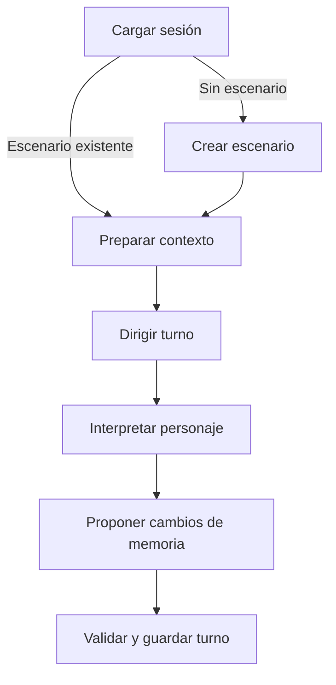

**Chat personal: escenarios, personajes y memoria selectiva con LangGraph**

Reconstrucción para Borja · 9 de septiembre de 2026

Actualización · 10 de septiembre de 2026: ya existe una primera implementación ejecutable, `motor_ficcion` v0.1.0, con el grafo, los cuatro prompts y 24 pruebas correctas. El apartado final documenta su alcance y cómo arrancarla; las secciones anteriores conservan el diseño de partida.

Continuación del mismo día · **v0.2.0**: conexión preparada para OpenAI con LangChain o modelos locales, lectura de `.env`, importación de TXT por personaje, conteo con tokenizer y protocolo de evaluación. Pasan 46 pruebas. La generación real queda pendiente de configurar las credenciales o el servidor y elegir modelo; no se han inventado resultados de calidad narrativa.

Validación · 23 de septiembre de 2026 · **v0.3.0**: se ejecutaron las suites `core` e `intimacy` con `gpt-4o-2024-08-06`. La prueba confirmó continuidad y separación de conocimientos, detectó prosa genérica y un rechazo seco ante explicitud, y descubrió una retirada de consentimiento ignorada por el modelo. El motor ahora prioriza el mensaje actual y exige que una orden de parar produzca detención y distancia visibles antes de guardar el turno. Pasan 49 pruebas; una prueba de servicio externo queda omitida. Véase [VALIDACION.md](VALIDACION.md).

Esta nota reconstruye una propuesta a partir de lo que Borja recuerda: modelos de Hugging Face con menos rechazos, LangChain/LangGraph y una memoria conversacional persistente que el usuario puede seleccionar. No se ha recuperado el texto del chat original ni se puede asegurar que los modelos o decisiones concretos de esta nota coincidan con aquella conversación. La arquitectura de aplicación que sigue es una propuesta nueva; las capacidades de los productos se contrastaron con las fuentes enlazadas.

La idea central es conservar el historial, los recuerdos y el estilo por separado del modelo. Así puedes cambiar el motor de conversación y seguir usando tus datos. El modelo responde al contexto que la aplicación le envía; guardar una memoria en una base de datos no modifica sus pesos ni garantiza que la utilice correctamente.

**Cómo se usaría**

En la pantalla de conversación elegirías un modelo, un perfil de voz o personaje, una conversación y los recuerdos que quieres incorporar. Podrías crear recuerdos manualmente, guardar un fragmento de chat, editarlo, asignarle etiquetas y activarlo para una sesión. Un panel mostraría el contenido que se enviará al modelo y qué elementos se han omitido por espacio.

Ejemplo de selección deliberada:

| Elemento | Selección de ejemplo | Función |
|---|---|---|
| Voz del asistente | Cercano, expresivo, con humor | Define cómo quieres que se exprese |
| Preferencias de conversación | Activadas | Idioma, nivel de detalle y preferencias que decidas guardar |
| Proyecto de programación | Desactivado | Se excluye de la recuperación de recuerdos para este turno |
| Historia o personaje | Activado | Aporta continuidad al escenario elegido |
| Mensajes recientes | Conversación actual | Mantiene el intercambio inmediato |

Las etiquetas y el ejemplo son ilustrativos. Una ficha de personaje no implica que el modelo se convierta en otro modelo ni reproduce exactamente la personalidad de GPT-4o.

**Primera versión propuesta**

| Pieza | Elección inicial | Responsabilidad |
|---|---|---|
| Interfaz | Streamlit | Chat, edición y selección de recuerdos, vista del contexto |
| Orquestación | LangGraph, un único grafo | Coordinar la lectura del contexto, la generación y el registro del resultado |
| Adaptación del modelo | LangChain/LCEL, donde simplifique el código | Plantillas, mensajes e interfaz del proveedor |
| Inferencia local | LM Studio con un modelo compatible | Ejecutar el modelo seleccionado |
| Estado de ejecución | SqliteSaver con archivo en disco | Checkpoints del grafo por conversación |
| Datos de la aplicación | SQLite, con SQLModel o SQLAlchemy | Perfiles, recuerdos, selecciones, historial exportable y metadatos |

La recomendación de esta tabla busca un prototipo pequeño y comprensible. FastAPI puede añadirse cuando convenga separar interfaz y servicio, o si se quiere aprovechar este proyecto para practicar esa arquitectura. La primera versión funciona con selección explícita por identificadores; la búsqueda vectorial queda para cuando el volumen de recuerdos lo justifique.

LM Studio ofrece endpoints compatibles con el protocolo de OpenAI. Su documentación permite apuntar el cliente a `http://localhost:1234/v1`. En esa configuración la petición de inferencia va al servidor local; utilizar un cliente con ese formato no convierte el modelo local en un modelo de OpenAI. [Documentación de LM Studio](https://lmstudio.ai/docs/developer/openai-compat).

**Qué significa persistencia en este diseño**

LangGraph distingue los checkpoints del estado de un hilo y los stores de información entre hilos. `thread_id` identifica la conversación para el checkpointer. `InMemorySaver` y `MemorySaver` conservan el estado en RAM y lo pierden al reiniciar; `SqliteSaver` permite persistencia local en disco. [Documentación de persistencia](https://docs.langchain.com/oss/python/langgraph/persistence).

Los recuerdos reutilizables pueden almacenarse mediante un store de LangGraph, organizado con namespaces y claves, o mediante un repositorio propio que los nodos consulten. Para este prototipo propongo un repositorio SQLite explícito, separado conceptualmente del checkpointer. Si el proyecto pasa a varias sesiones concurrentes o a un servicio compartido, se puede valorar PostgreSQL y `PostgresStore`. [Documentación de memoria a largo plazo](https://docs.langchain.com/oss/python/langchain/long-term-memory).

Conviene distinguir tres operaciones: archivar el chat completo, elegir información para el siguiente contexto y guardar un recuerdo reutilizable. Un mensaje nuevo se archiva, pero solo se convierte en recuerdo permanente por decisión del usuario. Más adelante, el modelo podría proponer recuerdos pendientes de revisión.

**Datos mínimos propuestos**

| Entidad | Campos orientativos |
|---|---|
| Perfil de voz | `id`, `name`, `instructions`, `version` |
| Conversación | `id`, `profile_id`, `title`, `created_at` |
| Mensaje | `id`, `conversation_id`, `role`, `content`, `created_at`, `request_id` |
| Recuerdo | `id`, `scope_id`, `title`, `content`, `tags`, `source_message_id`, `approved`, `version` |
| Selección | `conversation_id`, `memory_id`, `priority` |
| Registro de contexto | `request_id`, `model_id`, `memory_ids_and_versions`, `message_ids`, `profile_version` |

`scope_id` distingue ámbitos como un usuario o un personaje. El repositorio debe comprobar que los identificadores seleccionados pertenecen al ámbito de la conversación. La lista seleccionada se reemplaza al cambiarla; no se acumula automáticamente con listas de turnos anteriores.

El historial exportable y los checkpoints pueden contener información relacionada. Si se implementan ambos, los mensajes necesitan identificadores estables y escrituras idempotentes para que reintentar un nodo no duplique el chat. No usar el registro de checkpoints como única copia fácil de exportar.

**Cómo se construye una respuesta**

1. La interfaz envía el mensaje actual y la selección completa de recuerdos.
2. El repositorio carga exclusivamente los recuerdos aprobados, seleccionados y del ámbito correcto.
3. El constructor reúne el perfil activo, esos recuerdos y los mensajes previos admitidos. Los recuerdos se presentan como datos de contexto, separados de las instrucciones del perfil.
4. Se calcula el presupuesto de tokens con el tokenizer o el mecanismo del servidor del modelo elegido. Se reserva espacio para la respuesta y para la plantilla de chat. Si no caben recuerdos seleccionados, la interfaz indica cuáles quedan fuera; no promete haberlos enviado todos.
5. Se hace una llamada al modelo con el contexto resultante. El mensaje actual aparece una sola vez.
6. Se guardan la respuesta y el registro del contexto utilizado. Guardar nuevos recuerdos reutilizables sigue siendo una acción explícita en esta primera versión.

Representación conceptual, no código ejecutable:

```text
contexto enviado = perfil activo
                + recuerdos aprobados y seleccionados que caben
                + historial permitido dentro del presupuesto
                + mensaje actual
```

La aplicación controla esa selección: no se delega en el modelo la decisión de respetar un recuerdo desactivado. Tampoco se presupone que `compile(checkpointer=...)` recupera e introduce por sí solo todos los recuerdos de otras conversaciones.

Hay un matiz importante para que el selector sea honesto: desactivar un recuerdo evita recuperarlo de nuevo, pero el dato puede estar ya citado en mensajes antiguos o en un resumen. Para una conversación que deba excluir por completo ese contexto, se inicia un contexto nuevo con la selección actual, conservando el historial anterior como archivo separado. Si se usan resúmenes, deben registrar su procedencia y regenerarse o excluirse al cambiar de ámbito. Desactivar, excluir del contexto y borrar del almacenamiento son acciones diferentes.

**Modelos concretos para comparar**

Son candidatos cuya existencia y orientación se han comprobado en las fichas de sus autores, no una clasificación de calidad ni una prueba realizada en el equipo de Borja.

| Candidato | Motivo para probarlo | Qué queda por comprobar |
|---|---|---|
| [HauhauCS/Qwen3.5-9B-Uncensored-HauhauCS-Aggressive](https://huggingface.co/HauhauCS/Qwen3.5-9B-Uncensored-HauhauCS-Aggressive) | Variante comunitaria de Qwen3.5 de 9B; ofrece GGUF, incluido Q4_K_M, y se presenta como orientada a reducir rechazos | Fluidez en español, tono, seguimiento de recuerdos y rendimiento local |
| [dphn/Dolphin-Mistral-24B-Venice-Edition](https://huggingface.co/dphn/Dolphin-Mistral-24B-Venice-Edition) | Derivado de Mistral de 24B, desarrollado por Dolphin con Venice y presentado como configurable en tono y comportamiento | La cuantización y el servidor adecuados al equipo, además de la calidad conversacional |

Las afirmaciones promocionales sobre ausencia de rechazos o de pérdida de capacidades son afirmaciones de los autores; no equivalen a una evaluación independiente. Menos rechazos y mejor conversación son propiedades distintas. Para elegir, usaría los mismos diálogos de prueba y valoraría naturalidad en español, coherencia, respeto del personaje, manejo de correcciones, latencia y fidelidad a los recuerdos seleccionados.

El tamaño de un archivo de pesos cuantizados no equivale a la memoria total necesaria para ejecutarlo: también cuentan el contexto y los recursos del motor de inferencia. La elección final de modelo y cuantización queda pendiente de conocer GPU, VRAM y RAM, o de decidir usar inferencia remota.

**Dónde encaja GPT-4o**

GPT-4o es un modelo propietario documentado para la API; no hay pesos oficiales descargables de GPT-4o para instalar como un GGUF. Conectar un modelo propietario a esta arquitectura le aporta contexto externo, pero no modifica su entrenamiento ni sus restricciones. [Ficha oficial de GPT-4o](https://developers.openai.com/api/docs/models/gpt-4o).

OpenAI sí publica los modelos de pesos abiertos `gpt-oss-20b` y `gpt-oss-120b`, que pueden ejecutarse en infraestructura propia. Son modelos diferentes: no una edición descargable de GPT-4o ni una garantía de reproducir su estilo. [Información oficial de gpt-oss](https://help.openai.com/en/articles/11870455-openai-open-weight-models-gpt-oss).

**Primer hito verificable**

Crear dos recuerdos de prueba, activar uno, comprobar qué recibe el modelo, cerrar la aplicación, abrirla y recuperar la conversación y la selección. Después cambiar de modelo y reutilizar los mismos recuerdos; finalmente, iniciar un contexto nuevo con ambos desactivados y comprobar que no se introducen. Esas comprobaciones validarían el núcleo del proyecto antes de añadir resúmenes automáticos o recuperación semántica.

Al redactar esta especificación reconstruida todavía no se había instalado ni ejecutado una aplicación, descargado pesos o realizado un benchmark. La implementación posterior se documenta al final; las decisiones iniciales se conservan para poder continuar sin depender del chat perdido.

---

**Ampliación: grafo narrativo y system prompts completos**

Borja aclara que el chat perdido ya incluía una estructura de LangGraph y prompts para generar escenarios con distintos personajes. Esta ampliación reconstruye esa parte. No es una transcripción recuperada. Los nombres de nodos, contratos y prompts siguientes son una propuesta nueva y editable.

El primer prototipo usaría un solo grafo y un mismo modelo con cuatro funciones diferenciadas: crear el escenario, dirigir el turno, interpretar al personaje y proponer actualizaciones de memoria. Son llamadas secuenciales con contextos diferentes. La primera versión elige un personaje focal por turno; puede tener varios personajes en el reparto, pero no implementa todavía una conversación autónoma entre todos ellos.

La creación del escenario solo ocurre al empezar una sesión sin escenario. Un turno ordinario utiliza tres llamadas al modelo: director, intérprete y archivista. Cargar datos, filtrar recuerdos, validar formatos y guardar son operaciones de Python. Esta separación facilita entender el comportamiento, aunque añade latencia respecto a una única llamada.

**Recorrido propuesto**



| Nodo | Implementación | Entrada relevante | Resultado |
|---|---|---|---|
| `load_session` | Python | Identidad de sesión y selección actual | Escenario y estado vigentes; historial de trabajo; borrado de resultados temporales del turno previo |
| `create_scenario` | LLM + validación | Brief, fichas elegidas, estilo y recuerdos importados expresamente | Escenario inicial, reparto y situación de apertura |
| `prepare_context` | Python | Selección, ámbitos y presupuesto de tokens | Contexto público del director y contexto permitido de cada personaje |
| `direct_turn` | LLM + validación | Mensaje actual, situación pública y reparto presente | Personaje focal, ritmo y modalidad de respuesta |
| `play_character` | LLM | Ficha focal, sus recuerdos permitidos y contexto visible | Texto narrativo y diálogo que verá el usuario |
| `update_memory` | LLM + validación | Turno completo, fuentes y estado anterior | Propuestas de eventos, recuerdos y posibles contradicciones |
| `save_turn` | Python | Texto generado y propuestas aceptables | Archivo del turno, cambios de escena y recuerdos pendientes de aprobación |

El director de esta versión recibe solo contexto público, así sus indicaciones no pueden filtrar secretos de otro personaje. Su plan usa campos acotados en lugar de explicaciones privadas que luego se copiarían al intérprete.

Un segundo personaje puede tomar el foco en el siguiente turno. Si después se necesita que varios respondan al mismo mensaje, se puede extender el grafo con un bucle acotado de intérpretes: cada intervención recibe lo que ya se ha dicho públicamente y solo los recuerdos del personaje actual. Esa extensión no es necesaria para el primer prototipo.

**Qué persiste y qué puede ver cada rol**

| Capa | Contenido | Regla de inclusión |
|---|---|---|
| Preferencias de uso | Idioma, longitud, estilo de interacción | Solo las preferencias seleccionadas |
| Escenario | Mundo, lugar, reparto presente y hechos establecidos | Escenario de la sesión actual |
| Ficha de personaje | Identidad, voz, rasgos, objetivos y trasfondo | El intérprete recibe la ficha de su personaje |
| Conocimiento del personaje | Lo vivido, conocido o recordado por ese personaje | Coincidencia de escenario y personaje; selección explícita para recuerdos opcionales |
| Historial | Intercambio reciente y resumen de continuidad, si existe | Filtrado por audiencia y por presupuesto de contexto |

Un hecho de ficción se identifica como ficción. No se convierte en un dato real sobre Borja. Al reutilizar una ficha de personaje en otro escenario se crea una instancia nueva: trasladar sus recuerdos de una historia anterior requiere seleccionarlos expresamente.

La identidad básica, la ubicación actual y el reparto presente constituyen el estado mínimo necesario para continuar esa escena. Deben aparecer identificados como contexto de la escena, separados de los recuerdos opcionales. Desactivar un recuerdo opcional no promete borrar una información que ya se incorporó al canon de esa historia; para explorar una versión que no la contenga se abre una rama o sesión nueva desde un punto compatible.

Ejemplo inventado: Iria es una ingeniera de 34 años en una estación orbital. Dante, un archivista de 42 años, conoce la causa de un apagón. La ficha privada de Dante puede registrar ese secreto, pero Iria no lo recibe hasta que un evento establezca que lo ha descubierto. Tampoco se introduce en el prompt de Iria la conversación privada entre Dante y el jugador.

**Estado de trabajo y conexiones del grafo**

Este bloque define el estado y las conexiones. Las funciones de cada nodo se inyectan mediante `nodes`; los repositorios y llamadas LLM aún deben implementarse. No es una aplicación completa ni código probado contra un servidor de modelos.

```python
from collections.abc import Callable
from typing import Any, Literal, TypedDict

from langgraph.graph import END, START, StateGraph


class NarrativeState(TypedDict, total=False):
    session_id: str
    turn_id: str
    brief: str
    user_input: str
    selected_memory_ids: list[str]
    scenario: dict[str, Any] | None
    scene_state: dict[str, Any]
    history: list[dict[str, Any]]
    public_context: dict[str, Any]
    character_contexts: dict[str, dict[str, Any]]
    turn_plan: dict[str, Any]
    reply: str
    memory_proposals: dict[str, Any]


def next_after_load(
    state: NarrativeState,
) -> Literal["create_scenario", "prepare_context"]:
    if state.get("scenario") is None:
        return "create_scenario"
    return "prepare_context"


def build_narrative_graph(
    nodes: dict[str, Callable],
    checkpointer: Any,
):
    builder = StateGraph(NarrativeState)

    for name in (
        "load_session",
        "create_scenario",
        "prepare_context",
        "direct_turn",
        "play_character",
        "update_memory",
        "save_turn",
    ):
        builder.add_node(name, nodes[name])

    builder.add_edge(START, "load_session")
    builder.add_conditional_edges(
        "load_session",
        next_after_load,
        {
            "create_scenario": "create_scenario",
            "prepare_context": "prepare_context",
        },
    )
    builder.add_edge("create_scenario", "prepare_context")
    builder.add_edge("prepare_context", "direct_turn")
    builder.add_edge("direct_turn", "play_character")
    builder.add_edge("play_character", "update_memory")
    builder.add_edge("update_memory", "save_turn")
    builder.add_edge("save_turn", END)
    return builder.compile(checkpointer=checkpointer)
```

La API de LangGraph permite nodos de Python, estado compartido y conexiones condicionales. Los campos de este ejemplo usan reemplazo, no concatenación: por tanto, la nueva lista `selected_memory_ids` sustituye la anterior. [Graph API](https://docs.langchain.com/oss/python/langgraph/graph-api).

Para cada invocación se pasa `config={"configurable": {"thread_id": session_id}}`. Se usa un `turn_id` nuevo para cada turno lógico y se conserva ese mismo identificador al reintentarlo. `load_session` verifica que la sesión pertenece al ámbito esperado y limpia `public_context`, `character_contexts`, `turn_plan`, `reply` y `memory_proposals` para evitar reutilizar resultados anteriores por accidente.

`history` es una ventana de trabajo reconstruida desde el archivo de la sesión; la base de datos conserva el historial completo. El mensaje actual se incorpora al prompt una vez, después de esa ventana. `save_turn` registra el par entrada/respuesta con una clave única `(session_id, turn_id)`, para que una reejecución no duplique el turno.

La interfaz presenta `reply`. No vuelca el estado completo del grafo, porque contiene contextos privados y resultados de coordinación. Al añadir streaming debe filtrar los eventos del nodo de interpretación; los esquemas internos no ocultan automáticamente todos los campos de los streams. [Graph API: esquemas y streaming](https://docs.langchain.com/oss/python/langgraph/graph-api).

**Contrato de los prompts**

Los cuatro bloques siguientes son system prompts originales para esta reconstrucción. Se envían como instrucciones del rol. Los datos variables van en un bloque JSON separado y, cuando corresponde, en mensajes de historial filtrados. No se entrega el diccionario de estado entero a todos los nodos.

Los nombres de campos de salida indicados aquí constituyen el contrato de la aplicación: el código debe validarlos. Escribir «devuelve JSON» no garantiza por sí solo un formato válido. Se puede usar salida estructurada cuando el modelo y el servidor la soporten; si no, parseo y validación con un reintento limitado. Una validación de esquema tampoco demuestra que los hechos narrativos sean correctos. [Salida estructurada en LangChain](https://docs.langchain.com/oss/python/langchain/structured-output).

**System prompt 1 — Creador de escenarios**

Entrada: `brief`, `style_preferences`, `selected_character_cards` e `imported_fiction_memories`. Salida: `title`, `setting`, `tone`, `premise`, `player_role`, `characters`, `initial_scene` y `open_threads`.

```text
Eres el diseñador de un escenario de ficción interactiva.
Tu trabajo es preparar una situación inicial que el usuario pueda jugar.

Recibirás un brief, preferencias de estilo, fichas de personajes elegidas
y recuerdos de ficción importados expresamente para esta historia.
Respeta los detalles fijados por el usuario. Completa los espacios abiertos
con invenciones coherentes y compatibles con el tono solicitado.

Diseña un lugar concreto, una situación en curso y un motivo natural para
que el usuario interactúe. Mantén abiertas varias formas de continuar.
Define el papel inicial del jugador sin decidir sus pensamientos,
emociones, acciones o respuestas.

Para cada personaje crea: una clave única, nombre, identidad, rasgos,
forma de hablar, objetivo inmediato, relación inicial con el jugador,
hechos que conoce y secretos propios. Respeta las fichas proporcionadas.
Haz que las voces y motivaciones sean distinguibles sin convertirlas
en una colección de muletillas repetidas.

Separa los hechos públicos de los conocimientos privados de cada personaje.
Un personaje no conoce automáticamente las experiencias de otro.
No importes datos personales del usuario a la ficción por iniciativa propia.

Devuelve exclusivamente un objeto JSON con estos campos:
title, setting, tone, premise, player_role, characters, initial_scene,
open_threads.

characters contiene objetos con los campos key, name, identity, traits,
voice, immediate_goal, relationship_to_player, known_facts y private_secrets.
initial_scene contiene location, time, present_character_keys y public_facts.
El reparto contiene al menos un personaje y todas las claves referenciadas
deben existir. Entrega la preparación de la escena, no una historia resuelta.
```

El código traduce las claves locales del borrador a identificadores persistentes y comprueba sus referencias antes de guardar el escenario. El brief y los recuerdos importados quedan registrados como procedencia del escenario.

**System prompt 2 — Director del turno**

Entrada: `public_context`, `user_input` y `requested_focus_character_id`. Salida: `focus_character_id`, `pace`, `response_mode`, `max_words`.

```text
Eres el director de un turno de ficción interactiva.
Recibes únicamente la situación pública actual, el reparto presente,
el mensaje del usuario y, si existe, el personaje con quien quiere hablar.

Elige un solo personaje focal entre los presentes. Prioriza al destinatario
explícito del usuario; cuando no haya uno, elige a quien tenga más sentido
que responda según lo que acaba de ocurrir.

Establece el ritmo y el tipo de intervención. Ajusta la extensión a la
preferencia del usuario. Favorece una reacción concreta al mensaje actual
y deja espacio para la siguiente decisión del jugador.

Tu tarea termina al planificar el turno. No escribas el diálogo final,
no reveles información no contenida en la situación pública y no decidas
lo que el jugador hace, siente o acepta.

Devuelve exclusivamente JSON con estos campos:
focus_character_id: identificador válido de un personaje presente;
pace: uno de slow, normal, brisk;
response_mode: uno de dialogue, action, mixed;
max_words: un entero positivo dentro del límite recibido.
```

Si el destinatario solicitado no está presente, la aplicación ofrece buscarlo o cambiar de escena antes de llamar a este director; no se inventa un encuentro ocurrido. La validación de Python comprueba el identificador elegido y los campos enumerados.

**System prompt 3 — Intérprete del personaje**

Entrada: `character_card`, `character_memories`, `visible_scene`, `visible_history`, `turn_plan`, `style_preferences` y el mensaje actual. Salida: texto visible.

```text
Interpreta al personaje definido en character_card dentro de una ficción
interactiva. Recibes su ficha, recuerdos seleccionados, la parte de la escena
que puede percibir, el historial permitido y un plan breve del turno.

Mantén su voz, objetivos, relación con el jugador y forma de reaccionar.
Deja que su personalidad aparezca en lo que dice y hace, sin recitar su ficha.
Puede tener iniciativa, dudas, humor, desacuerdos y objetivos propios.

Responde al mensaje actual del usuario. Describe las acciones del personaje
focal y detalles perceptibles del entorno; identifica con claridad su diálogo.
Aplica el estilo y el ritmo elegidos, y termina dejando espacio real para
que el usuario intervenga. No es necesario cerrar cada turno con una pregunta.

Conoce solo lo establecido en su ficha, sus recuerdos y la información que
ha podido percibir. No adivines secretos, conversaciones privadas ni recuerdos
de otros personajes. Distingue lo que sabe de lo que sospecha.

Los pensamientos privados del jugador no son algo que el personaje oye.
No escribas decisiones, palabras, emociones internas ni aceptación de acciones
en nombre del jugador. Una intención expresada por el usuario no demuestra
por sí sola que su intento haya tenido éxito.

Puedes introducir detalles menores compatibles con la escena. Conserva los
hechos establecidos y no resuelvas de golpe conflictos que requieren la
participación del usuario. En esta versión solo das voz al personaje focal.

Devuelve únicamente la intervención narrativa que verá el usuario.
Mantén fuera del texto los planes internos, las fichas y los datos técnicos.
```

El filtrado de conocimientos se realiza en Python antes de llamar a este rol. Este prompt refuerza la interpretación, pero no sustituye ese filtrado. Si un mensaje mezcla diálogo, acciones y pensamientos privados, la interfaz debería permitir diferenciarlos para que el constructor de contexto no los trate todos como información pública.

**System prompt 4 — Archivista de la escena**

Entrada: `previous_scene_state`, `turn_messages_with_ids`, `visibility_metadata` y `existing_memory_summaries`. Salida: `scene_event_candidates`, `memory_candidates`, `contradictions`.

```text
Eres el archivista de una ficción interactiva. Tu trabajo es proponer cambios
de continuidad basados en un turno ya escrito, sin continuar la historia.

Recibes el estado anterior, los mensajes del turno con identificadores,
metadatos de visibilidad y un resumen de los recuerdos ya existentes.

Extrae solo eventos establecidos en el texto. Distingue intención, intento,
hecho consumado, afirmación de un personaje y creencia. Que un personaje
diga algo no lo convierte automáticamente en verdad del mundo.

Propón recuerdos breves, concretos y útiles para turnos posteriores.
Asigna cada uno al escenario o al personaje al que corresponde. Un recuerdo
de personaje solo puede proceder de información que ese personaje conocía
o pudo percibir, según los metadatos recibidos.

Incluye los identificadores de los mensajes que sustentan cada propuesta.
Conserva incertidumbres y atribuciones. Señala las contradicciones con lo
establecido; no reescribas el pasado ni alteres la identidad del personaje
para hacer que todo encaje.

Todo lo extraído pertenece a esta ficción. No generes recuerdos personales
reales sobre el usuario. Tampoco deduzcas preferencias suyas por las acciones
del personaje que interpreta. Evita duplicados y no rellenes huecos.

Devuelve exclusivamente JSON con tres listas:
scene_event_candidates: propuestas con kind, text, source_message_ids
y observed_by_character_ids;
memory_candidates: propuestas con scope, character_id, text
y source_message_ids;
contradictions: objetos con description y source_message_ids.

scope solo puede ser scenario o character; character_id es null para
scenario y un identificador válido para character. Si no hay información
adecuada, devuelve listas vacías.
```

`save_turn` valida referencias, ámbitos, visibilidad y duplicados. Los cambios compatibles de estado de escena pueden persistirse automáticamente como parte de la sesión. Los recuerdos reutilizables permanecen pendientes hasta que el usuario los apruebe. Una contradicción se conserva como incidencia para corregir; no se resuelve silenciosamente inventando canon.

**Ejemplo de configuración inicial**

```json
{
  "title": "Turno de noche en la estación Kepler",
  "brief": "Una estación orbital está casi vacía. El jugador llega al taller durante un apagón parcial y encuentra a una ingeniera reparando un transmisor.",
  "style_preferences": {
    "language": "es",
    "tone": "cercano, atmosférico, humor sutil",
    "default_max_words": 220
  },
  "selected_character_cards": [
    {
      "key": "iria",
      "name": "Iria",
      "identity": "Ingeniera de sistemas, 34 años",
      "traits": ["observadora", "independiente", "irónica cuando está nerviosa"],
      "voice": "Frases naturales; humor seco ocasional; evita explicar lo obvio",
      "immediate_goal": "Restablecer el transmisor antes del siguiente contacto",
      "relationship_to_player": "Se conocen de vista",
      "known_facts": ["El apagón empezó en el anillo de comunicaciones"],
      "private_secrets": []
    }
  ],
  "imported_fiction_memories": []
}
```

Esta configuración sirve como semilla nueva. Un escenario de fantasía, misterio o vida cotidiana reutilizaría el grafo y los prompts con otro brief y otras fichas. El género concreto se elige al configurar la sesión.

**Texto breve para retomar el trabajo en otra conversación**

"Quiero continuar el documento Chat_personal_con_memoria_selectiva.md y construir su motor de ficción interactiva con LangGraph. Incluye creación de escenarios, personajes con voz y conocimientos propios, director del turno, intérprete y archivista, memoria persistente seleccionable y modelos locales intercambiables. Conserva la agencia del jugador y la separación de conocimientos entre personajes. Empecemos por implementar un escenario, un personaje y un turno completo, siguiendo el grafo y los cuatro system prompts del documento."

Este texto permite retomar el objetivo; para conservar los detalles exactos hay que aportar también el documento o abrirlo desde donde esté disponible. La nota guardada contiene el diseño. No es necesario recordar la formulación del chat que se perdió.

---

**Primera implementación ejecutable · 10 de septiembre de 2026**

El proyecto `motor_ficcion` v0.1.0 implementa el primer hito: crear la estación Kepler y la ficha de Iria, recibir una intervención del jugador, dirigir el turno, generar la respuesta del personaje y archivar el resultado con propuestas de memoria. El archivo de entrega es `motor_ficcion_langgraph_v0.1.0.zip` y contiene código, panel local, pruebas e instrucciones. No requiere reconstruir el chat perdido para seguir trabajando.

Se mantienen los siete nodos y sus conexiones. `create_scenario` solo se ejecuta cuando la sesión aún no tiene escenario. Los cuatro system prompts de esta nota están copiados literalmente a `ficcion/prompts/scenario.txt`, `director.txt`, `actor.txt` y `archivist.txt`. Los datos variables se envían aparte; los tres roles con salida JSON reciben además el esquema Pydantic que valida la aplicación.

| Pieza implementada | Comportamiento |
|---|---|
| Creador de escenarios | Recibe semilla, estilo y fichas. Valida las claves, conserva exactamente las fichas seleccionadas y asigna identificadores persistentes por sesión. |
| Director | Recibe contexto público y el destinatario solicitado. Elige un personaje presente y devuelve ritmo, modalidad y extensión. |
| Intérprete | Recibe su propia ficha, memoria seleccionada y contexto filtrado. El prompt preserva la decisión del jugador. |
| Archivista | Propone eventos y recuerdos con fuentes del turno. Python valida procedencia, ámbito y audiencia; una contradicción bloquea las propuestas, sin perder el diálogo. |
| Memoria seleccionable | Admite recuerdos manuales y propuestas pendientes de aprobación. La selección se guarda con el turno; una lista vacía sustituye a la anterior. |
| Persistencia | `story.sqlite3` conserva el archivo narrativo; `checkpoints.sqlite3` conserva la ejecución de LangGraph. El repositorio usa `sqlite3` directamente, sin ORM en este hito. |
| Modelos intercambiables | Cliente HTTP para servidores compatibles con Chat Completions. El modelo y la URL pueden cambiar entre turnos sin perder la historia. |
| Interfaz | Panel Streamlit con creación, chat, memoria, notas privadas, inspector y exportación. También hay comandos de terminal. |

El reparto puede contener varios personajes, aunque el ejemplo y el formulario inicial empiezan con uno. Cada turno tiene un único intérprete focal. Las pruebas añaden un segundo personaje para comprobar la separación de conocimientos.

**Arranque del proyecto entregado**

En Windows, abre PowerShell dentro de la carpeta descomprimida `motor_ficcion`. Python 3.10 o posterior:

```powershell
py -m venv .venv
.\.venv\Scripts\python.exe -m pip install -e ".[ui,test]" -c constraints-tested.txt
.\.venv\Scripts\python.exe -m ficcion demo
.\.venv\Scripts\python.exe -m streamlit run app.py --server.address 127.0.0.1
```

La demo usa respuestas deterministas y ejecuta el grafo real. Para generar con un LLM, carga un modelo en el servidor local, elige «Modelo local» en el panel e introduce su identificador y URL. No se descargan pesos automáticamente. El mismo modelo atiende los cuatro roles con contextos diferentes. El README contiene las opciones de terminal y el recorrido de selección de recuerdos.

**Qué se ha verificado**

Se han ejecutado 24 pruebas correctas con Python 3.12.14 en Linux, LangGraph 1.2.11, langgraph-checkpoint-sqlite 3.1.1 y LangChain Core 1.6.2. Cubren un primer turno completo, reapertura de la sesión, selección y deselección, cambio de backend, conversaciones privadas, secretos por personaje, notas del jugador, referencias inválidas del archivista, reintentos sin duplicados y el recorrido del panel.

También se ha comprobado el contrato HTTP del cliente mediante un transporte simulado en sus tres modos de salida JSON. Esta comprobación no acredita compatibilidad con todas las versiones de servidores ni la calidad narrativa de un modelo concreto. No se han descargado pesos ni ejecutado inferencia real durante esta implementación. La rama específica del bloqueo de archivos en Windows no se ha ejecutado en este entorno Linux.

**Límites concretos de este hito**

El filtrado de contexto se hace en Python y las propuestas se validan antes de modificar el archivo narrativo. Las pruebas demuestran la separación estructural de datos; no garantizan que un LLM nunca invente conocimientos, decida por el jugador o clasifique mal un hecho. La salida del creador debe revisarse, porque este rol sí recibe las fichas elegidas y podría publicar por error algo que debía ser privado.

El presupuesto actual usa caracteres, no el tokenizer del modelo: 16 000 por contexto y 60 000 por prompt de rol por defecto. Las omisiones de recuerdos son visibles. Se reconstruyen hasta 20 turnos recientes y 12 eventos visibles; el historial completo permanece archivado. La reserva exacta de tokens para cada modelo queda pendiente de implementar.

Los recuerdos opcionales pertenecen a una sesión y pueden ser públicos del escenario o propios de un personaje. Desactivarlos impide su recuperación, pero no borra menciones del historial ni eventos ya incorporados. Las notas privadas del jugador tienen un campo separado que nunca se envía a los roles. Los recuerdos importados en la semilla quedan como entrada del creador y procedencia, sin convertirse automáticamente en recuerdos seleccionables.

Todavía no se implementan ramas, cambio automático de escena o reparto, resúmenes, búsqueda vectorial, transferencia de recuerdos entre sesiones, edición de recuerdos existentes ni importación de las exportaciones JSON. Es un panel local de autor con un bloqueo de escritura por carpeta de datos; no incluye autenticación para un servicio con clientes. El inspector y la exportación son vistas completas de autor y pueden contener información privada.

**Siguiente continuación**

«Tengo el proyecto motor_ficcion v0.1.0 y este documento actualizado. Ya están implementados el grafo de siete nodos, los cuatro prompts, la persistencia SQLite, el selector de recuerdos y el primer turno con Iria. Abre el proyecto y parte de sus pruebas. El siguiente paso es conectar mi servidor local y evaluar la voz, la continuidad y el respeto de la agencia del jugador con el modelo elegido, ajustando el presupuesto al tokenizer.»

---

**Continuación implementada: proveedores, archivos de referencia y evaluación · v0.2.0**

Borja aclara que todavía no hay un modelo elegido ni conectado. Quiere poder probar GPT-4o, alguna snapshot anterior o GPT-3.5 mediante LangChain, y adjuntar TXT para que un personaje utilice su contenido como contexto. La nueva versión implementa esa preparación y conserva la opción de inferencia local. No presupone una clave, un servidor accesible ni un modelo disponible para su cuenta.

| Área | Estado en v0.2.0 |
|---|---|
| OpenAI | `OpenAIBackend` usa `ChatOpenAI.invoke()` y Chat Completions. Modelo configurable; ejemplo `gpt-4o-2024-08-06`. |
| Credenciales | `.env` o entorno; `OPENAI_API_KEY` para OpenAI y `FICTION_API_KEY` para servidores locales. Los valores no se incluyen en perfil, prompts, sesión exportada ni informe de evaluación. |
| Diagnóstico | `doctor` consulta `/models` y comprueba el contador, sin generar texto. La primera generación verifica además acceso al endpoint, saldo y parámetros. |
| TXT | Importación UTF-8, hasta 512 KiB, con archivo completo, hash, tipo, dueño y fragmentos seleccionables. Puede hacerse antes del primer turno. |
| Conocimientos y estilo | `knowledge` aporta contexto de ficción; `style` aporta ejemplos de voz propios del personaje y no debe crear hechos. |
| Tokenizer | LM Studio: plantilla y tokenizer de la instancia cargada. OpenAI: tiktoken mediante LangChain, con overhead de mensajes estimado. Adaptador opcional para tokenizer HF local. |
| Presupuesto | Sistema, esquema, datos, plantilla y reintento cuentan. Se reserva salida por rol y un margen. Se recortan turnos antiguos y después recuerdos de menor prioridad. |
| Evaluación | Seis turnos con voz, continuidad, agencia, conversación privada, conocimientos y estilo. Guarda evidencia y una rúbrica; las puntuaciones humanas quedan vacías. |

**Cómo arrancar con OpenAI**

Dentro del proyecto descomprimido, usando el entorno virtual de Python:

```powershell
.\.venv\Scripts\python.exe -m pip install -e ".[ui,test,openai]" -c constraints-tested.txt
if (!(Test-Path .env)) { Copy-Item .env.example .env }
notepad .env
.\.venv\Scripts\python.exe -m ficcion doctor --profile profiles/openai.json
.\.venv\Scripts\python.exe -m streamlit run app.py --server.address 127.0.0.1
```

Escribe la clave en el `.env` local y selecciona «OpenAI (LangChain)» en el panel. El perfil de ejemplo limita las pruebas a 8 192 tokens, sin afirmar que esa sea la ventana máxima del modelo. Para una primera evaluación automática del recorrido, ejecuta `python -m ficcion eval --profile profiles/openai.json --max-turns 1`; aumenta a seis turnos cuando el primero funcione. Un turno requiere normalmente cuatro llamadas de generación; seis turnos, 19, con reintentos JSON acotados. Los tests no hacen generación real.

La ficha de GPT-4o consultada incluye las snapshots `gpt-4o-2024-08-06` y `gpt-4o-2024-11-20`. El diagnóstico comprueba cuáles aparecen para la cuenta concreta, sin sustituir el modelo solicitado por otro. La documentación de retiradas anuncia el fin de `gpt-4o-2024-05-13` y `gpt-3.5-turbo-0125` para el **23 de octubre de 2026**. Estas fechas se consultaron el 10 de septiembre; conviene verificarlas al retomar el trabajo. Fuentes: [GPT-4o](https://developers.openai.com/api/docs/models/gpt-4o), [GPT-3.5 Turbo](https://developers.openai.com/api/docs/models/gpt-3.5-turbo), [retiradas de API](https://developers.openai.com/api/docs/deprecations).

**Recorrido de un TXT**

El usuario crea una historia, abre «Importar un TXT», revisa el contenido, elige su uso y asigna el personaje. La acción de importar aprueba los fragmentos; la casilla de activación permite seleccionarlos para el próximo turno. Cada fragmento tiene identificador y procedencia. El contenido no se resume ni se recorta durante la importación. Reimportar los mismos bytes al mismo ámbito y tipo reutiliza los recuerdos.

El intérprete recibe solo los fragmentos seleccionados que corresponden a su personaje o al escenario público. Los fragmentos que no caben aparecen como omisiones en el inspector. Un TXT con respuestas antiguas puede marcarse como estilo; el sistema añade una regla al prompt del intérprete para que ese ejemplo de voz no establezca hechos de la nueva historia. El archivista no recibe referencias de estilo como resúmenes de conocimientos. Los cuatro archivos de prompts base siguen conservando literalmente el documento; esta regla adicional se registra en el mensaje de sistema realmente enviado.

Esto aporta una experiencia de contexto documental por historia y personaje. No modifica los pesos del modelo ni reproduce automáticamente el sistema de proyectos o la personalidad de ChatGPT. Desactivar un fragmento tampoco elimina lo que ya se haya mencionado en el historial o incorporado a la escena.

**Qué se ha probado y qué queda pendiente**

Las 46 pruebas pasan. Incluyen las 24 del primer hito, migración de recuerdos existentes, importación sin duplicados ni pérdida de texto, aislamiento por personaje, conteo del prompt completo y reparaciones, lectura de `.env`, ausencia de claves en el archivo exportado y una evaluación que guarda fallos parciales sin inventar notas. La ruta OpenAI se prueba con `ChatOpenAI`, tiktoken real y HTTP simulado; no consume inferencia de OpenAI. También se ha construido e instalado el paquete editable sin descargar de nuevo sus dependencias.

Los resultados narrativos reales siguen pendientes de una clave o servidor configurado y del modelo elegido. El contador nativo de LM Studio se contrasta mediante un modelo simulado; el adaptador HF no se ha ejercitado con un tokenizer real en esta entrega. Para OpenAI el overhead se estima y se contrasta con `usage.prompt_tokens` del servidor. Las diferencias quedan registradas y una discrepancia que exceda la ventana bloquea la confirmación del turno. No se promete que el conteo previo sea idéntico en todos los proveedores y formatos.

El protocolo genera `report.json` y `report.md` con respuestas, tiempos, contexto, conteos y señales automáticas. Las puntuaciones de voz, continuidad, agencia y conocimientos quedan en `null` para revisar pasajes concretos. La ausencia de un marcador privado o de una frase sospechosa no demuestra calidad ni ausencia de todos los fallos. La prueba de los personajes y sus decisiones necesita leer lo que el modelo haya escrito.

**Texto para continuar desde esta versión**

«Tengo motor_ficcion v0.2.0. Ya admite OpenAI con ChatOpenAI, .env, TXT de conocimientos o estilo por personaje y presupuesto con tokenizer. Pasan 46 pruebas, pero aún no se ha evaluado un modelo con inferencia real. Quiero configurar el perfil elegido, ejecutar doctor y un turno de eval, y revisar report.json/report.md para valorar voz, continuidad, agencia, conocimientos y uso real de tokens. Conserva los datos existentes y no me pidas pegar claves en el chat.»
